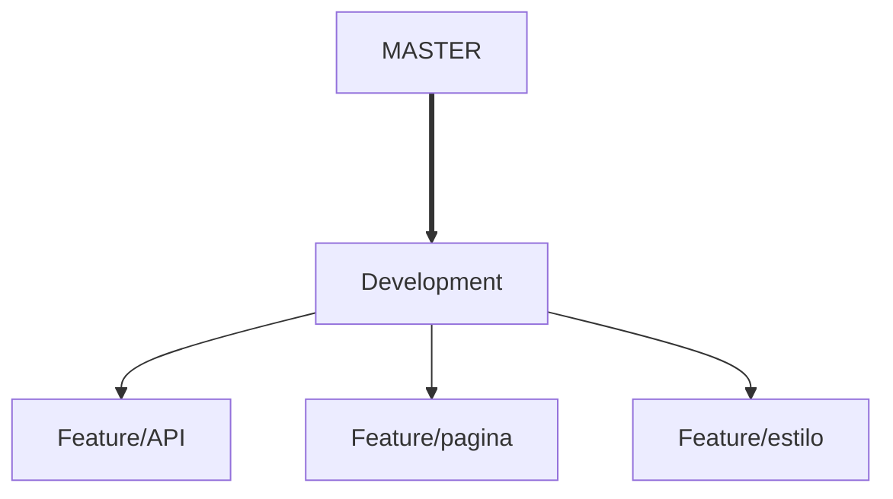

# Controle para fluxo de pagamentos.

## Controle das entradas e saídas financeiras de um grupo escoteiro

### Escopo preliminar.

O objetivo deste projeto é criar uma plataforma básica para controlar as entradas e saídas de caixa de um grupo escoteiro e implementar controles estatisticos de custos para planejamento das finanças do grupo ao longo do ano.

As etapas iniciais preveem.

- Lançamento das mensalidades pagas pelos escoteiros
- Lançamento dos custos ao longo do mês.
- Verificar a taxa de inadimplência.
- Montar um modelo de previsão de custos versus receita anual para o planejamento das melhorias na unidade.

### Informações importantes

O Front End deve estar dentro da pasta resources, no seguinte caminho.

``ControleDePagamentos/src/main/resources/static``

O banco de dados será gerado automaticamente pelo Flyway que deve ser inserido no seguinte caminho.

``ControleDePagamentos/src/main/resources/db.migration``
o nome do arquivo deve obedecer a seguinte nomenclatura.

``v1__nome-do-arquivo``

a cada mudança, coloca se o prefixo de forma sequencial. Por exemplo: ``v2__outro nome``

a cada mudança não reescreva o que já foi executado nas versões anteriores pois os comando serão executados de forma duplicada.

Para saber mais, acesse.

[Documentação do Flyway](https://documentation.red-gate.com/flyway)

### Estrutura das ramificações

